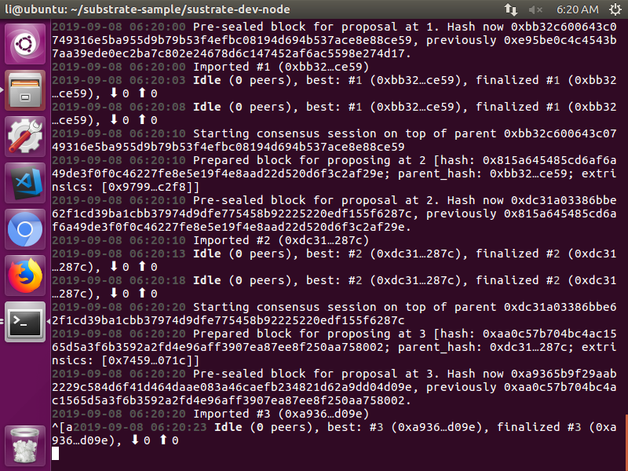
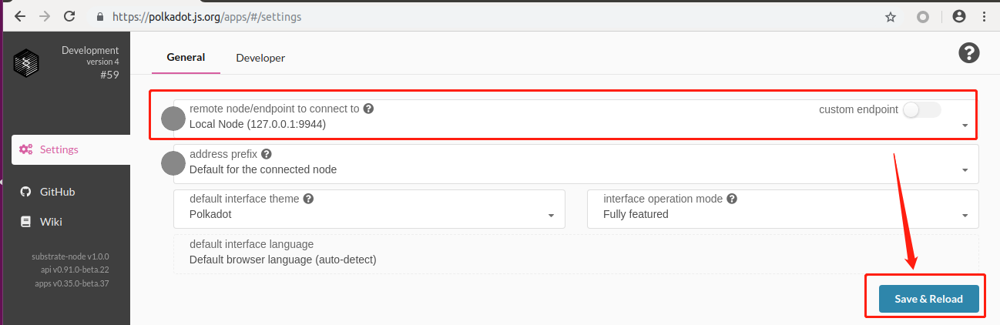
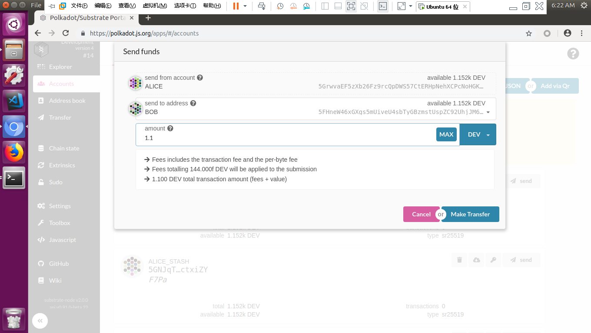
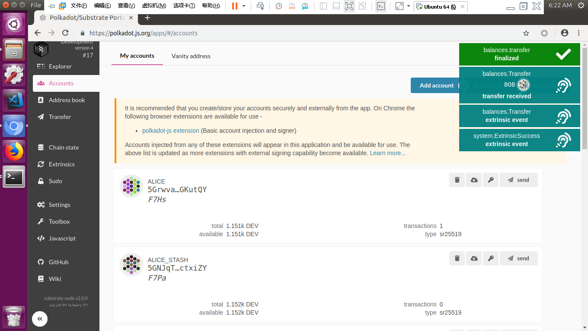
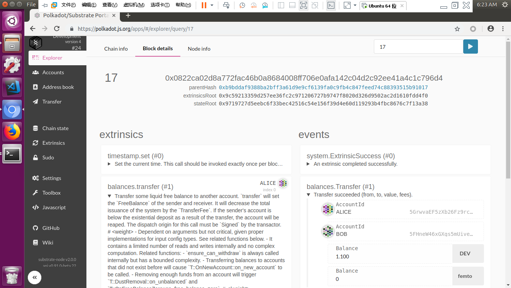

* 1.请在本目录完成第一课作业；

* 2.完成后，请及时提交作业；

* 3.提交作业过程：
> 本人账号（guobin）/仓库（TeamX）-分支（master）→ 组织（SubstrateOrg）/团队（TeamX）-个人分支（01-guobin）


运行环境 ubuntu16.04

# 一 安装rust环境及相关工具（fast参数跳过安装substrate）

curl https://getsubstrate.io -sSf | bash -s -- --fast


# 二 创建项目

curl https://raw.githubusercontent.com/paritytech/substrate-up/4f3d476d2271a1cae6014a22255d0c7aa85692e7/substrate-node-new -sSf | bash -s sustrate-dev-node lismith


#三 初始化项目

cd sustrate-dev-node


//初始化wasm构建环境

./scripts/init.sh


# 四 启动单点测试项目

WASM_BUILD_TYPE=release cargo run -- --dev



# 五 打开前端
▪访问 https://polkadot.js.org/apps/#/explorer
▪ 点击 Settings 配置⻚⾯
▪ 选择本地节点



点击save & reload按钮，自动刷新区块链数据


# 六 转账

## 1 发送交易




## 2 交易成功，



##  

## 3 包含交易的区块详细资料




# 七 遇到的问题：

执行如下命令

```
https://raw.githubusercontent.com/paritytech/substrate-up/4f3d476d2271a1cae6014a22255d0c7aa85692e7/substrate-node-new -sSf |  sh -s sustrate-dev-node lismith
```

提示

```
-e   Substrate Node Template Setup 
sh: 16: [[: not found
sh: 16: sustrate-dev-node: not found
sh: 22: [[: not found
sh: 22: lismith: not found
sh: 30: Bad substitution
```

原因

就是sh不支持[[这样的扩展，bash支持[[扩展。可以将脚本中的sh改成bash

sh只是一个符号链接，最终指向是一个叫做dash的程序，自Ubuntu 6.10以后，系统的默认shell /bin/sh被改成了dash（Ubuntu中将默认shell改为dash的主要原因是效率。由于Ubuntu启动过程中需要启动大量的shell脚本，为了优化启动速度和资源使用情况，Ubuntu做了这样的改动。）。dash(the Debian Almquist shell) 是一个比bash小很多但仍兼容POSIX标准的shell，它占用的磁盘空间更少，执行shell脚本比bash更快，依赖的库文件更少，当然，在功能上无法与bash相比。


