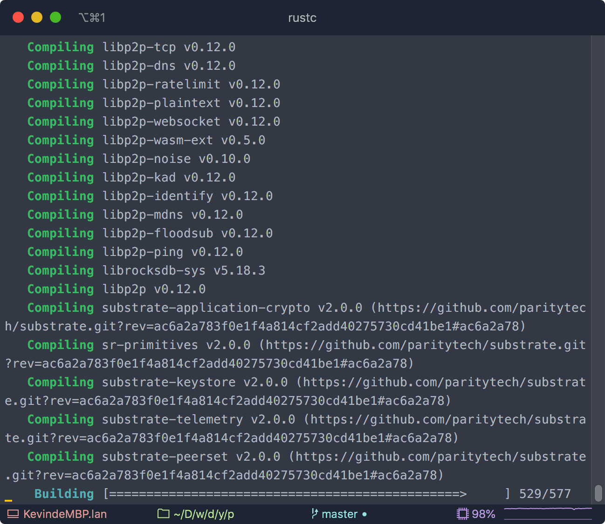
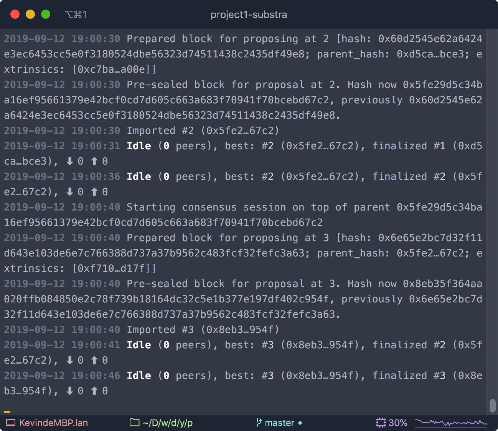
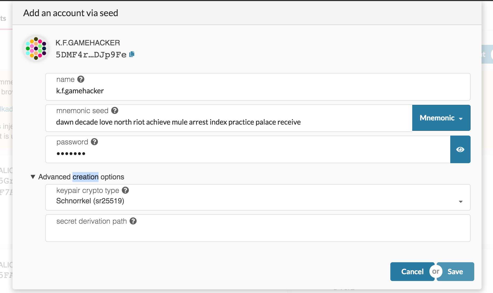
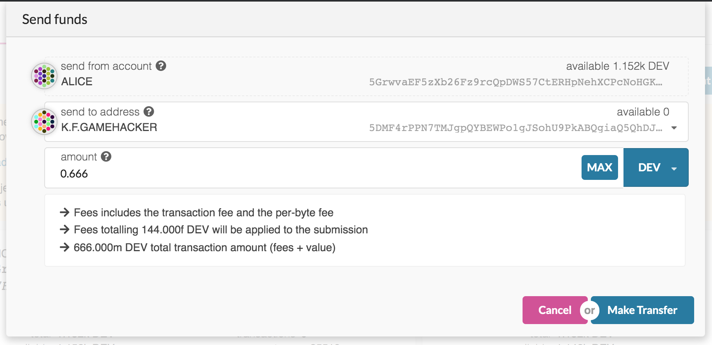
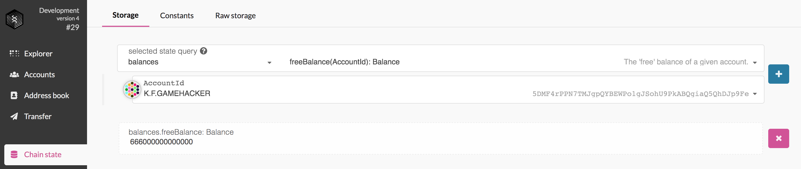
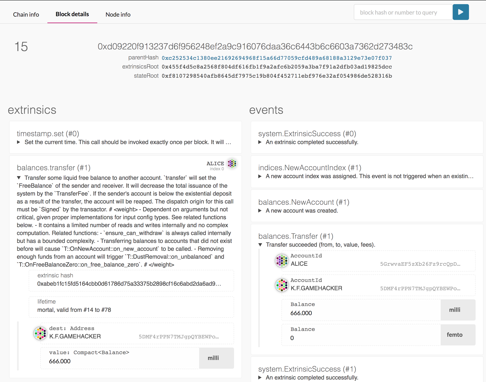

# Substrate 课程 第一次作业

## 目标：在本地启动测试网络，完成系列链上操作
- 步骤:
	1. Clone Substrate Repo
	2. Compile
    
	3. 启动本地测试网
    
	4. 通过 Subtrate Portal 连接本地节点并进行链上操作
		* 出块
		* 创建账户
        
		* 发送交易
        
		* 确认交易
        
		* 查看交易信息
		